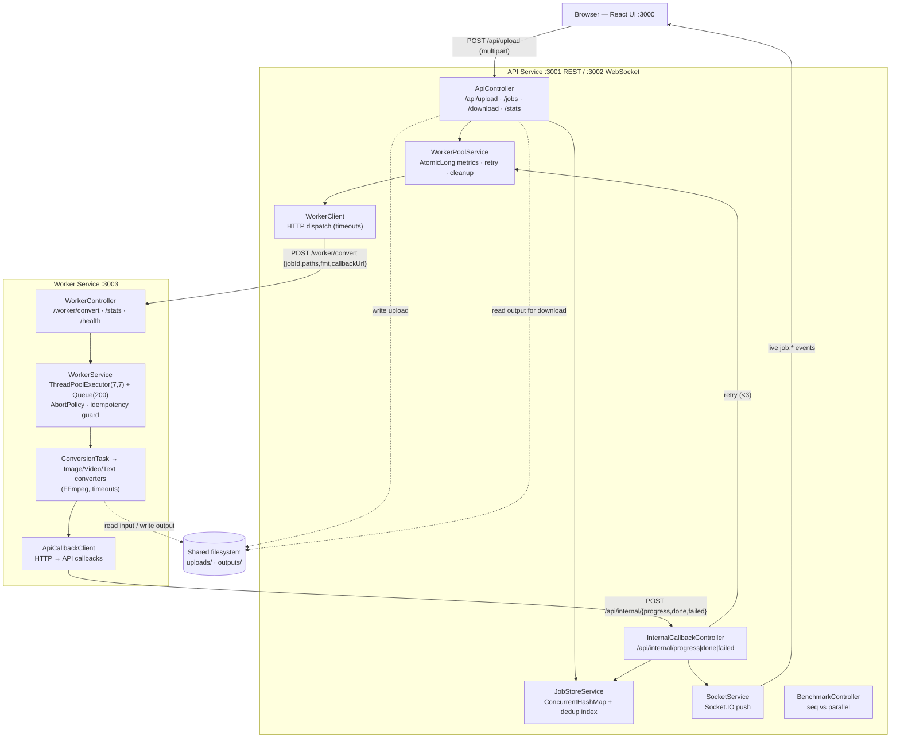
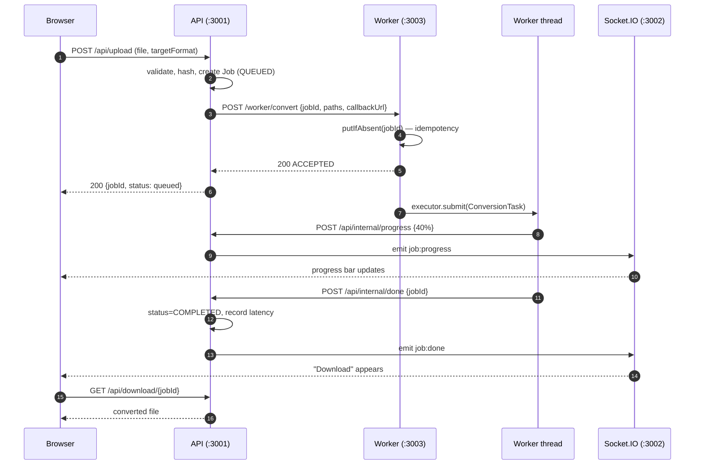
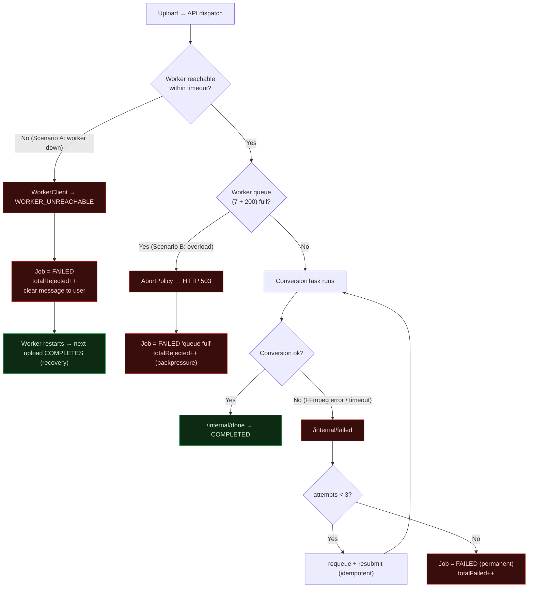

# THREADCONV — Diagrams

Architecture, async sequence, and failure-propagation diagrams (Mermaid — renders
on GitHub).

---

## 1. Architecture

---

## 2. Async sequence (happy path)

---

## 3. Failure propagation

